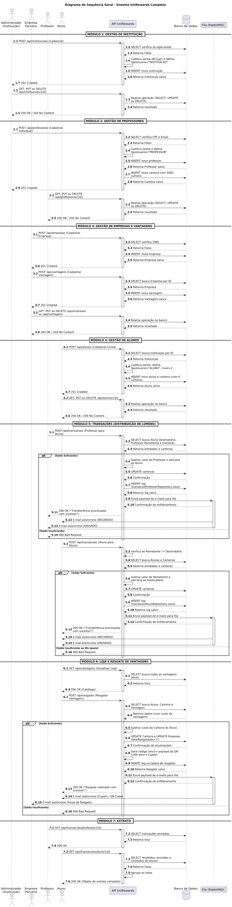
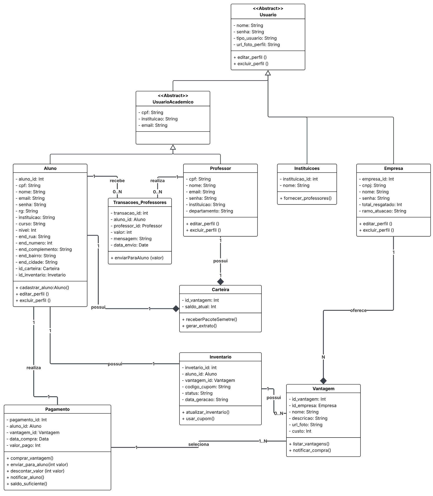
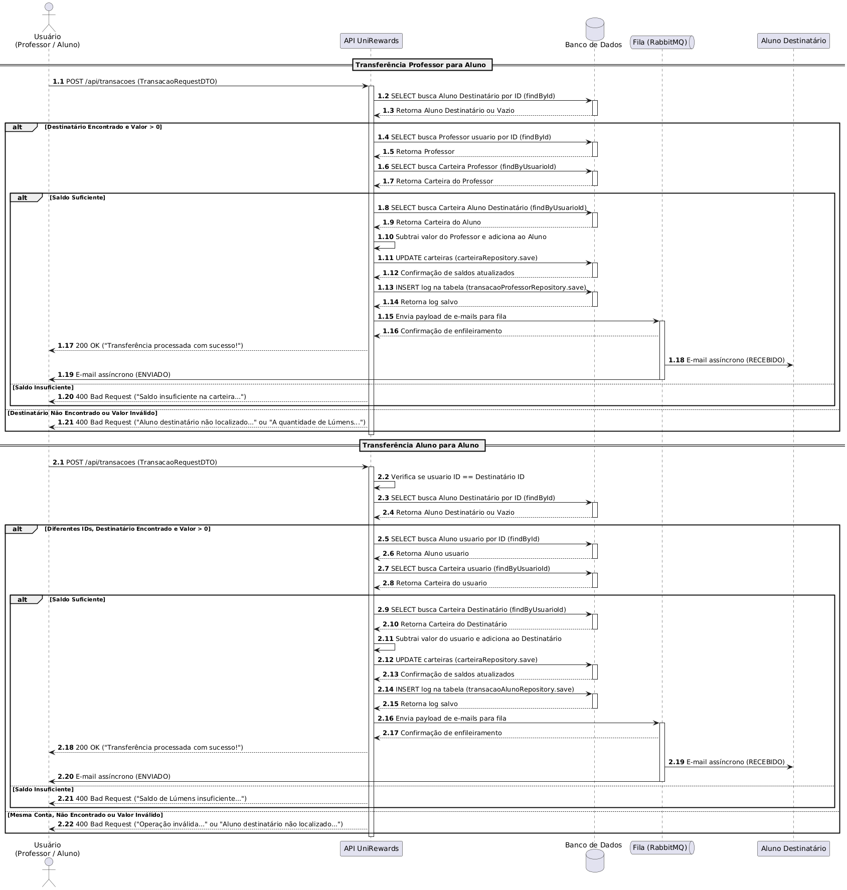
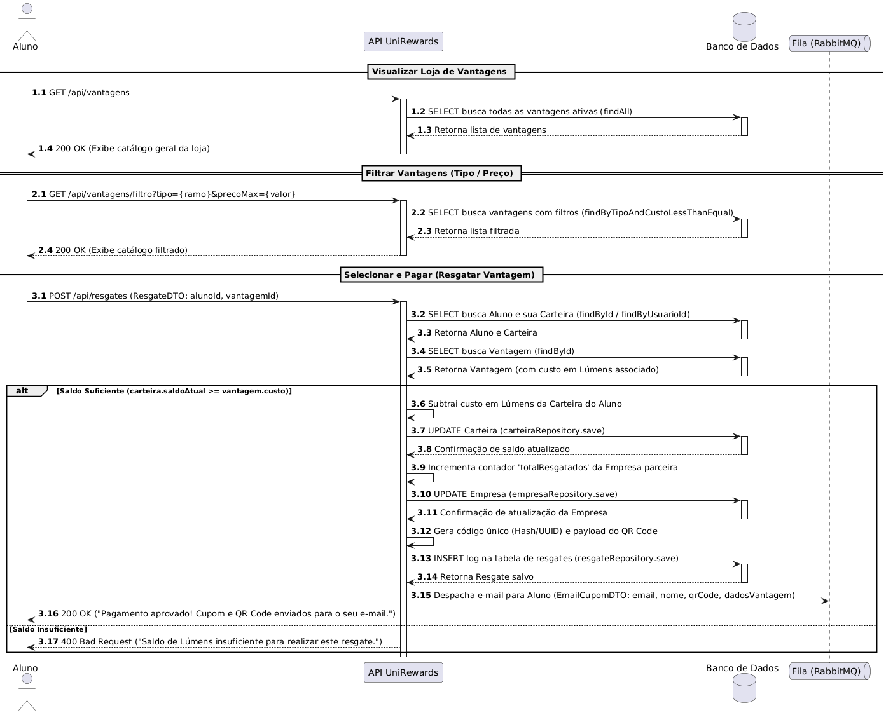
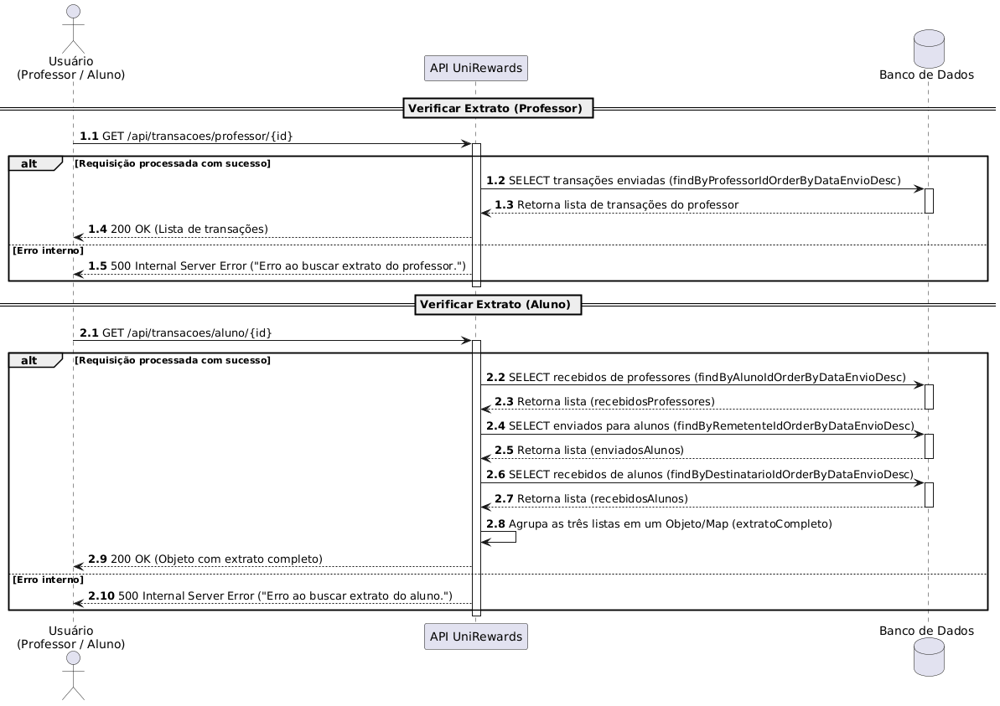
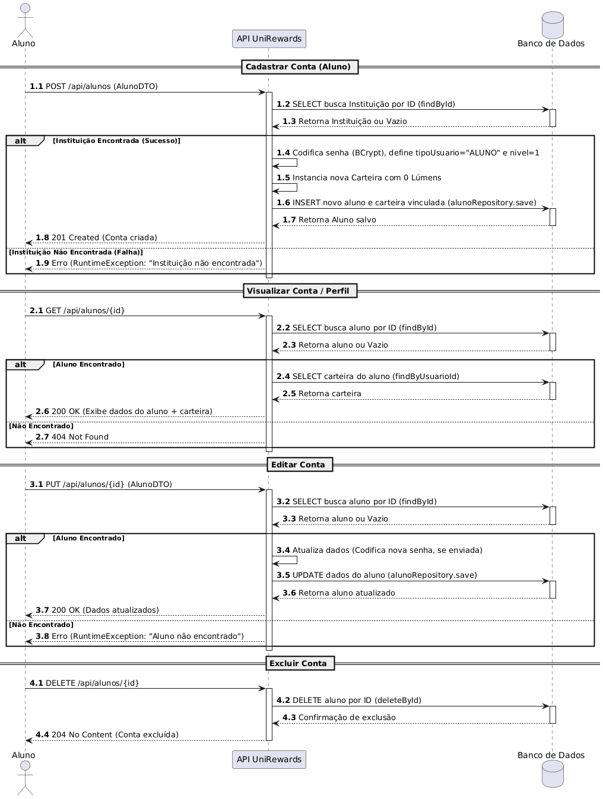
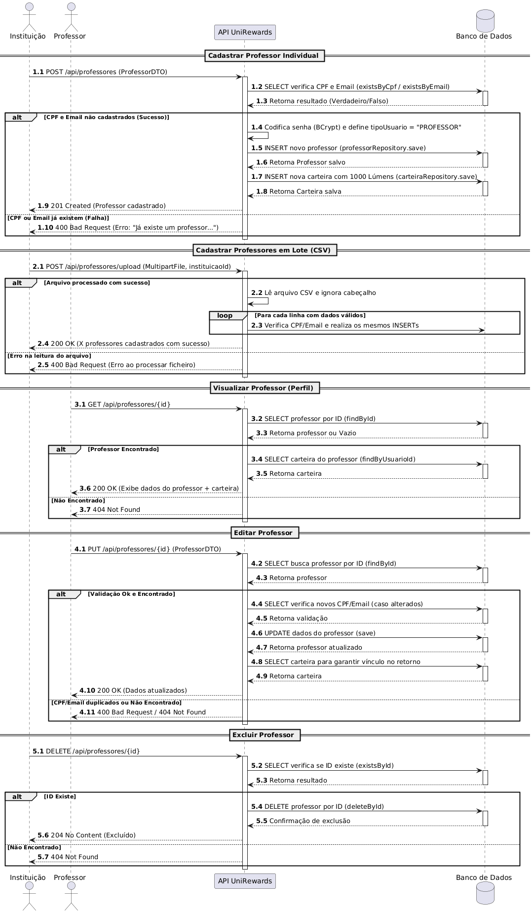
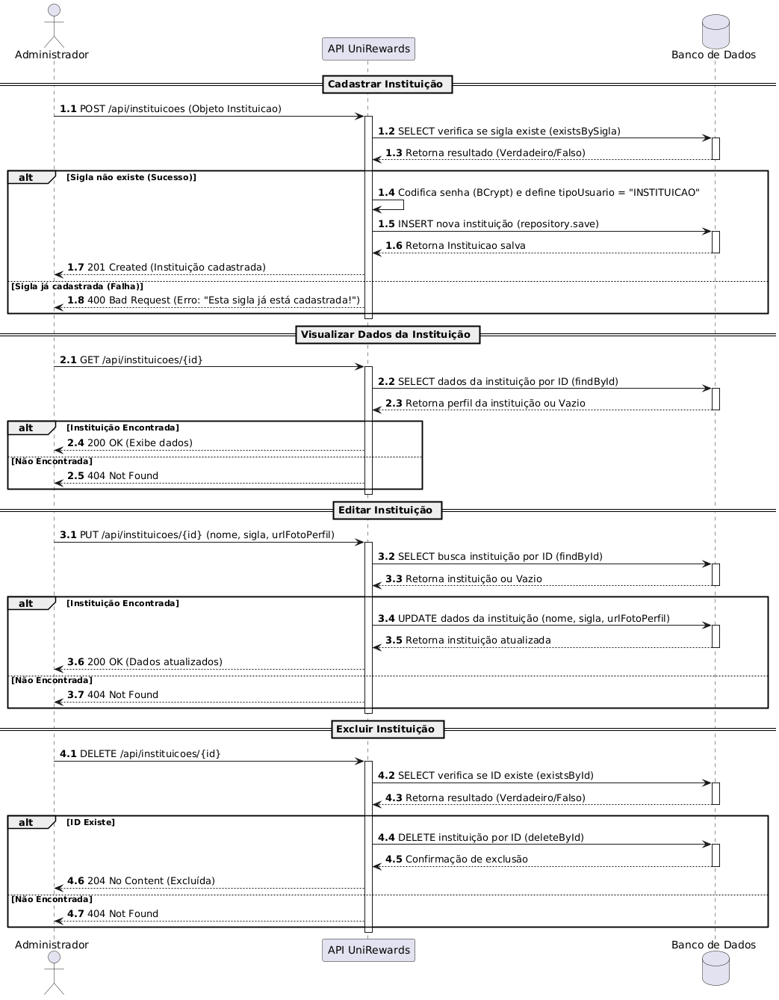
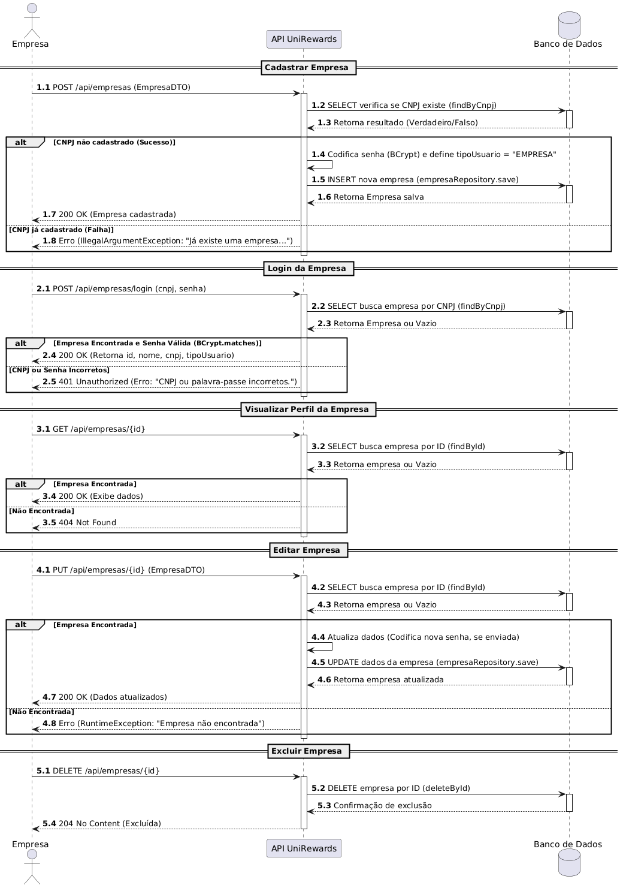
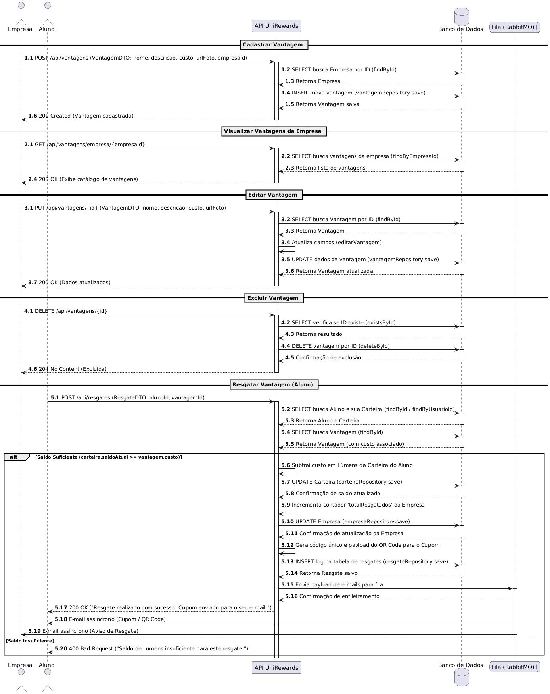

# 🏷️ Estudantes Lúmen 👨‍💻

<table>
  <tr>
    <td width="60%">
      <div align="justify">
        Este é um projeto de <b>Sistema de Moeda Estudantil</b>, onde o aluno participante poderá resgatar vantagens atráves de seu empenho estudantil.
      </div>
    </td>
    <td>
      <td width="40%">
        
      </div>
    </td>
  </tr> 
</table>

---

## 🚧 Status do Projeto

[](https://github.com/joaopauloaramuni/laboratorio-de-desenvolvimento-de-software/releases) 
 
 
 
 
 
 
 
 
 
 
 
 


---

## 📚 Índice
- [Links Úteis](#-links-úteis)
- [Sobre o Projeto](#-sobre-o-projeto)
- [Histórias do Usuário](#-histórias-do-usuário)
- [Funcionalidades Principais](#-funcionalidades-principais)
- [Tecnologias Utilizadas](#-tecnologias-utilizadas)
- [Arquitetura](#-arquitetura)
  - [Exemplos de diagramas](#exemplos-de-diagramas)
- [Instalação e Execução](#-instalação-e-execução)
  - [Pré-requisitos](#pré-requisitos)
  - [Variáveis de Ambiente](#-variáveis-de-ambiente)
     - [1 Back-end (Spring Boot)](#1-back-end-spring-boot)
     - [2 Front-end (React, Vite)](#2-front-end-react-vite)
     - [3 Exemplos de Variáveis de Ambiente na Vercel](#3-exemplos-de-variáveis-de-ambiente-na-vercel)
  - [Instalação de Dependências](#-instalação-de-dependências)
    - [Front-end (React)](#front-end-react)
    - [Back-end (Spring Boot)](#back-end-spring-boot)
  - [Inicialização do Banco de Dados (PostgreSQL)](#-inicialização-do-banco-de-dados-postgresql)
  - [Como Executar a Aplicação](#-como-executar-a-aplicação)
    - [Terminal 1: Back-end (Spring Boot)](#terminal-1-back-end-spring-boot)
    - [Terminal 2: Front-end (React, Vite)](#terminal-2-front-end-react-vite)
    - [Execução Local Completa com Docker Compose (Incluindo Banco de Dados)](#-execução-local-completa-com-docker-compose-incluindo-banco-de-dados)
    - [Passos para build, inicialização e execução](#-passos-para-build-inicialização-e-execução)
- [Deploy](#-deploy)
- [Estrutura de Pastas](#-estrutura-de-pastas)
- [Demonstração](#-demonstração)
  - [Aplicativo Mobile](#-aplicativo-mobile)
  - [Aplicação Web](#-aplicação-web)
  - [Exemplo de saída no Terminal (para Back-end, API, CLI)](#-exemplo-de-saída-no-terminal-para-back-end-api-cli)
- [Documentações utilizadas](#-documentações-utilizadas)
- [Autores](#-autores)
- [Contribuição](#-contribuição)
- [Agradecimentos](#-agradecimentos)
- [Licença](#-licença)

---

## 🔗 Links Úteis
* 🌐 **Demo Online:** [Acesse a Aplicação Web](<https://unirewards.vercel.app/>)
  > 💻 **Descrição:** Link para a aplicação em ambiente de produção.

---

## 📝 Sobre o Projeto

O Estudantes Lúmens é uma plataforma de gamificação voltada ao engajamento acadêmico. O sistema recompensa o esforço dos alunos (frequência e desempenho) com Lúmens, uma moeda virtual que pode ser trocada por benefícios e prêmios em empresas parceiras.

* 🎯 **Propósito:**
  - Por que existe: Para combater a desmotivação e a falta de propósito percebida por muitos alunos durante a vida acadêmica.
  - Problema que resolve: A baixa participação em aulas e a falta de incentivos tangíveis para o esforço estudantil além das notas.
  - Contexto: Projeto desenvolvido no ambiente acadêmico para simular um ecossistema real de fidelização educacional.
  - Onde utilizar: Escolas, faculdades e cursinhos que buscam reduzir a evasão e aumentar a produtividade dos estudantes.

* ✨ **Entrega de Valor:**
  - O projeto transforma o estudo em uma experiência meritocrática: o aluno é recompensado pelo seu tempo e energia, as instituições aumentam sua retenção e empresas parceiras ganham um canal direto com o público jovem.

---

## Histórias do Usuário

* **Cadastro e Acesso**
  * **HS01 - Aluno deseja ingressar no sistema**
    - Como aluno, quero me cadastrar no sistema informando meus dados pessoais (nome, email, CPF, RG, endereço), selecionando minha instituição, meu curso e definhando uma senha.

  * **HS02 - Cadastro de Empresa Parceira**
    - Como representante de uma empresa, quero cadastrar minha organização no sistema, informando uma lista de professores e também oferecendo vantagens e produtos aos alunos em troca de moedas virtuais.

  * **HS03 - Autenticação**
    - Como usuário (aluno, professor ou empresa), quero realizar login com CPF e senha para acessar as funcionalidades restritas do sistema com segurança.

* **Professor**
  * **HS04 - Distribuição de Moeda**
    - Como professor, quero enviar moedas do meu saldo para um aluno específico, inserindo uma mensagem obrigatória de justificativa, para reconhecer seu bom desempenho ou comportamento.

  * **HS05 - Consulta de Saldo e Extrato (Professor)**
    - Como professor, quero visualizar meu saldo atual de moedas e o histórico de envios realizados, para gerir minha distribuição de mérito.
   
* **Aluno**
  * **HS06 - Notificação de Recebimento**
    - Como aluno, quero ser notificado por um email automático sempre que um professor me enviar moedas e o reconhecimento recebido.

  * **HS07 - Consulta de Saldo e Extrato (Aluno)**
    - Como aluno, quero consultar meu saldo total e o extrato de transações (recebimentos de professores e trocas por vantagens) para acompanhar minha economia de moedas.

  * **HS08 - Resgate de Vantagem**
    - Como aluno, quero selecionar uma vantagem disponível no sistema e trocá-la por minhas moedas.

  * **HS09 - Resgate de Cupom**
    - Como aluno, ao realizar uma troca, quero receber um email com um código gerado pelo sistema para que eu possa apresentar a confirmação da troca presencialmente na empresa.

* **Vantagens**
  * **HS10 - Cadastro de Vantagens**
    - Como empresa parceira, quero cadastrar produtos ou descontos, incluindo descrição, foto e custo em moedas, para ficarem visíveis no catálogo dos alunos.

  * **HS11 - Notificação de Resgate**
    - Como empresa parceira, quero receber um email com o código da transação sempre que um aluno resgatar uma vantagem minha, para que eu possa conferir e validar a entrega do produto ou serviço.


---
## ✨ Funcionalidades Principais

- 🔐 **Autenticação e Perfis:** Múltiplos perfis de acesso (Instituição, Professor, Aluno, Empresa).
- 💰 **Transações Acadêmicas:** Transferência de Lúmens de Professor para Aluno, e de Aluno para Aluno (Peer-to-Peer).
- 🛍️ **Marketplace de Vantagens:** Catálogo virtual com filtros e sistema de resgate baseado em saldo.
- 📨 **Mensageria Assíncrona:** Envio automático de cupons e comprovantes via E-mail utilizando RabbitMQ.
- 📊 **Extratos Detalhados:** Histórico completo de envios e recebimentos para controle do usuário.

---

## 🛠 Tecnologias Utilizadas

As seguintes ferramentas, frameworks e bibliotecas foram utilizados na construção deste projeto. Recomenda-se o uso das versões listadas (ou superiores) para garantir a compatibilidade.

### 💻 Front-end

* **Framework/Biblioteca:** HTML
* **Linguagem/Superset:** JavaScript ES6+
* **Estilização:** CSS

### 🖥️ Back-end

* **Linguagem/Runtime:** Java 21 (JDK), Node.js
* **Framework:** Spring Boot 3.x
* **Persistência:** Spring Data JPA / Hibernate
* **Mensageria:** Spring AMQP (RabbitMQ)
* **E-mails:** JavaMailSender
* **Hospedagem:** Render
* **Autenticação:** Spring Security

### ⚙️ Infraestrutura & DevOps

* **Containerização:** Docker
* **Message Broker:** RabbitMQ hospedado no CloudAMQP
* **Cloud:**  Vercel, Render, Supabase

---

## 🏗 Arquitetura

A arquitetura do **UniRewards** foi desenhada utilizando o modelo **Monolítico em Camadas (Layered Architecture)** no Back-end, focado em separação de responsabilidades (SoC), aliado a uma comunicação assíncrona orientada a eventos para rotinas lentas.

### 🧩 Padrões de Projeto e Decisões Arquiteturais

1. **Arquitetura em Camadas (MVC adaptado para REST API):**
   - O fluxo de requisições segue a estrutura padrão do Spring Boot: `Controller` -> `Facade` / `Service` -> `Repository`. Isso garante que as rotas da API não conheçam detalhes do banco de dados, e que o banco de dados não dependa das regras de negócio.

2. **Facade Pattern (`/facade`):**
   - Empregamos o padrão Facade para orquestrar rotinas complexas que envolvem múltiplos serviços. Isso simplifica as chamadas nos Controllers e centraliza a coordenação de fluxos maiores (como cadastros compostos e validações cruzadas) em um único ponto.

3. **Data Transfer Objects (`/dto`):**
   - Utilizamos DTOs de entrada (Requests) e saída (Responses). O contrato da API é estritamente separado das Entidades (`/model`). Isso impede vazamento de dados sensíveis e o infame *Over-Posting*.

4. **Tratamento Global de Exceções (`/exception`):**
   - Centralização do tratamento de erros através de *Controller Advices*. Permite que a API retorne respostas padronizadas e limpas (`400 Bad Request`, `404 Not Found`) sempre que uma regra de negócio ou validação falhar.

5. **Mensageria Assíncrona (Event-Driven):**
   - A distribuição de e-mails de cupons e confirmações de transação foi desacoplada da thread principal (`TransacaoService`). O uso do **RabbitMQ** garante que o resgate na loja seja executado em milissegundos no banco de dados, enquanto o disparo do e-mail ocorre em segundo plano.

### Diagramas

Para melhor visualização e entendimento da estrutura do sistema, os diagramas principais estão organizados lado a lado.

| Caso de Uso Geral | Fluxo de Sequência Geral |
| :---: | :---: |
|  |  |

| Diagrama de Classes | Diagrama Entidade-Relacionamento |
| :---: | :---: |
|  |  |

| Diagrama de Componentes |
| :---: | 
|  | 

### 📌 Diagramas de Sequência Isolados (CRUDs e Processos)

| Módulo | Diagrama |
| :--- | :--- |
| **Transações de Lúmens** |  |
| **Resgate de Vantagem** |  |
| **Extrato do Usuário** |  |
| **CRUD de Aluno** |  |
| **CRUD de Professor** |  |
| **CRUD de Instituição** |  |
| **CRUD de Empresa** |  |
| **CRUD de Vantagens** |  |

---

## 🔧 Instalação e Execução

### Pré-requisitos
Certifique-se de que o usuário tenha o ambiente configurado.

* **Java JDK:** Versão **21** ou superior (Necessário para o **Back-end Spring Boot**)
* **PostgreSQL:** Para rodar o banco localmente, caso não use o Supabase.
* **RabbitMQ:** Necessário localmente caso não utilize o CloudAMQP.
* **Docker** (Opcional, mas **altamente recomendado** para rodar o Banco de Dados)

---

### 🔑 Variáveis de Ambiente

O projeto requer variáveis específicas para conexão de banco, fila e porta do servidor. O arquivo base pode ser configurado em `src/main/resources/application.properties`.

#### Configurações de Banco de Dados e Fila (Exemplo Nuvem / Render)

| Variável | Descrição | Exemplo de Produção |
| :--- | :--- | :--- |
| `PORT` | Porta forçada do servidor. | `10000` |
| `DB_PASSWORD` | Senha do banco (Supabase). | `<sua-senha>` |
| `RABBITMQ_HOST` | Host do cluster de filas. | `jaragua.lmq.cloudamqp.com` |
| `RABBITMQ_PORT` | Porta de acesso seguro (TLS). | `5671` |
| `RABBITMQ_USER` | Usuário do VHost. | `lggfunal` |
| `RABBITMQ_PASS` | Senha de acesso do broker. | `<sua-senha-amqp>` |
| `RABBITMQ_VHOST` | Virtual Host dedicado. | `lggfunal` |

> 💡 **Nota Arquitetural:** O `application.properties` da aplicação está configurado para negociar `TLS` na fila (`spring.rabbitmq.ssl.enabled=true`) e conta com tolerância de timeout otimizada para nuvens.

### 📦 Instalação de Dependências

1. **Clone o Repositório:**
```bash
git clone [https://github.com/ViniSimoesV/Sistema-de-Moedas-Estudantil.git](https://github.com/ViniSimoesV/Sistema-de-Moedas-Estudantil.git)
cd Sistema-de-Moedas-Estudantil
```

---

## 📂 Estrutura de Pastas

Descreva o propósito das pastas principais.

```
.
├── /.github                     # 🤖 Automações, fluxos CI/CD e metadados do GitHub
├── /.mvn                        # ☕ Arquivos de configuração do Maven Wrapper
├── /documentos                  # 📚 Base de conhecimento do projeto
│   ├── /Apresentação            # Slides e pitches
│   ├── /Diagrama                # Matrizes visuais do sistema
│   │   ├── /Caso-de-Uso         # DUCs
│   │   ├── /Classe              # Relacionamentos de objetos
│   │   ├── /Componentes         # Diagrama de infraestrutura
│   │   ├── /Implantação         # Diagrama de infraestrutura
│   │   ├── /DER                 # Entidade-Relacionamento do DB
│   │   └── /Sequencia           # Fluxos temporais completos e isolados (PlantUML)
│   └── /Histórias de Usuário    # Backlog e requisitos transcritos
│
├── /frontend                    # 💻 Código-fonte da Aplicação Web do Aluno/Instituição
│   ├── /assets                  # Imagens gerais, logos e SVGs
│   ├── /css                     # Folhas de estilo da plataforma
│   ├── /js                      # Lógica de integração com a API, manipulação de DOM
│   ├── /static                  # Arquivos imutáveis do projeto
│   └── index.html               # Ponto de entrada (Login/Dashboards)
│
├── /src/main/java/br/com/lumens/unirewards  # ⚙️ Código-fonte da API Back-end Java
│   ├── /config                  # Definições (RabbitMQConfig, Beans, Jackson)
│   ├── /controller              # Rotas HTTP e interface da API (Endpoints)
│   ├── /dto                     # Contratos rígidos de entrada e saída (Requests/Responses)
│   ├── /exception               # Captura e tratamento centralizado de erros
│   ├── /facade                  # Padronização de integrações e fluxos complexos multi-serviços
│   ├── /model                   # Entidades JPA (Alunos, Professores, Empresas, Transações)
│   ├── /repository              # Camada de comunicação com o PostgreSQL (Spring Data JPA)
│   ├── /security                # Módulos de autorização e filtros de requisição
│   ├── /service                 # Core do sistema e lógica de negócio central (Transactional)
│   └── UniRewardsApplication.java # Bootstrap do Spring Boot
│
├── /src/main/resources          # 📄 Propriedades nativas do Back-end
│   └── application.properties   # Connection Strings, Configurações de E-mail (SMTP) e Filas
│
├── docker-compose.yml           # 🐳 Script local para subir cluster RabbitMQ 
├── pom.xml                      # 📦 Central de dependências Maven do Back-end
└── README.md                    # 📘 Documentação da aplicação (Este arquivo)
```

---

## 🎥 Demonstração

Use GIFs e prints para mostrar o projeto em ação.  

> [!WARNING]
> Dê preferência a hospedar suas imagens em um **CDN** (Content Delivery Network) ou no **GitHub Pages** para garantir que elas carreguem rapidamente e não quebrem. Saiba mais sobre o GitHub Pages clicando [aqui](https://github.com/joaopauloaramuni/joaopauloaramuni.github.io).

### 📱 Aplicativo Mobile

- GIF de demonstração (exemplo de fluxo de usuário):  

| Demonstração 1 | Demonstração 2 | Demonstração 3 | Demonstração 4 |
|----------------|----------------|----------------|----------------|
|  |  |  |  |
| _Sua gif aqui_ | _Sua gif aqui_ | _Sua gif aqui_ | _Sua gif aqui_ |

Para melhor visualização, as telas principais estão organizadas lado a lado.

| Tela | Captura de Tela |
| :---: | :---: |
| **Tela Inicial (Home)** | **Tela de Perfil / Settings** |
|  |  |
| **Tela de Cadastro** | **Tela de Lista / Detalhes** |
|  |  |

### 🌐 Aplicação Web

Para melhor visualização, as telas principais estão organizadas lado a lado.

| Tela | Captura de Tela |
| :---: | :---: |
| **Página Inicial (Home)** | **Página de Login** |
|  |  |
| **Cadastro de Clientes** | **Cadastro de Produtos** |
|  |  |
| **Dashboard (Visão Geral)** | **Página Admin / Configurações** |
|  |  |

---

## 🔗 Documentações utilizadas

Liste aqui links para documentação técnica, referências de bibliotecas complexas ou guias de estilo que foram cruciais para o projeto.

* 📖 **Framework/Biblioteca (Front-end):** [Documentação Oficial do **React**](https://react.dev/reference/react)
* 📖 **Build Tool (Front-end):** [Guia de Configuração do **Vite**](https://vitejs.dev/config/)
* 📖 **Framework (Back-end):** [Documentação Oficial do **Spring Boot**](https://docs.spring.io/spring-boot/docs/current/reference/html/)
* 📖 **Containerização:** [Documentação de Referência do **Docker**](https://docs.docker.com/)
* 📖 **Guia de Estilo:** [**Conventional Commits** (Padrão de Mensagens)](https://www.conventionalcommits.org/en/v1.0.0/)
* 📖 **Documentação Interna:** [Design System do Projeto](./docs/design-system.md)

---

## 👥 Autores
Liste os principais contribuidores. Você pode usar links para seus perfis.

| 👤 Nome | 🖼️ Foto | :octocat: GitHub | 💼 LinkedIn | 📤 Gmail |
|---------|----------|-----------------|-------------|-----------|
| Vinícius Simões  | <div align="center"></div> | <div align="center"><a href="https://github.com/ViniSimoesV"></a></div> | <div align="center"><a href="https://www.linkedin.com/in/vinicius-simoes-dev/"></a></div> | <div align="center"><a href="vinisv2004@gmail.com"></a></div> |
| Luiz Arthur  | <div align="center"></div> | <div align="center"><a href="https://github.com/Chapeugenerico"></a></div> | <div align="center"><a href="https://www.linkedin.com/in/user2"></a></div> | <div align="center"><a href="mailto:user2@gmail.com"></a></div> |

---

## 🙏 Agradecimentos
Em ambiente acadêmico, citar fontes e inspirações é crucial (integridade acadêmica). Em ambiente profissional, mostra humildade e conexão com a comunidade.

Gostaria de agradecer aos seguintes canais e pessoas que foram fundamentais para o desenvolvimento deste projeto:

* [**Engenharia de Software PUC Minas**](https://www.instagram.com/engsoftwarepucminas/) - Pelo apoio institucional, estrutura acadêmica e fomento à inovação e boas práticas de engenharia.
* [**Prof. Dr. João Paulo Aramuni**](https://github.com/joaopauloaramuni) - Pelos valiosos ensinamentos sobre **Arquitetura de Software** e **Padrões de Projeto**.
* [**Fernanda Kipper**](https://www.instagram.com/kipper.dev/) - Pelos valiosos ensinamentos em **Desenvolvimento Web**, **DevOps** e melhores práticas em **Front-end**.
* [**Rodrigo Branas**](https://branas.io/) - Pela didática excepcional em **Clean Architecture** e **Clean Code**.
* [**Código Fonte TV**](https://codigofonte.tv/) - Pelo vasto conteúdo e cobertura de notícias, tutoriais e apoio à comunidade de **Desenvolvimento Web**.

---
